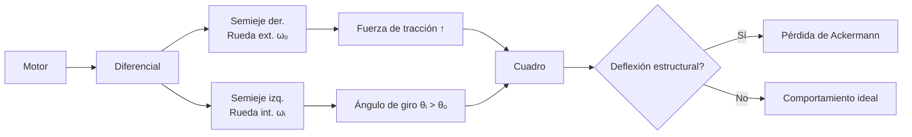
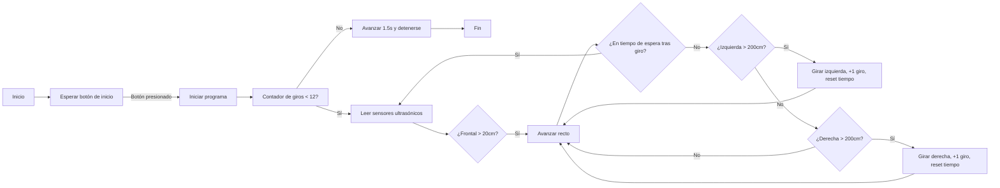
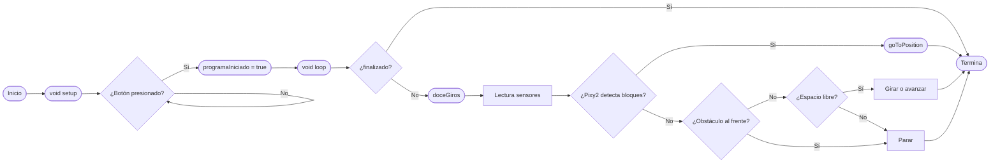

# Equipo [Team ValGrind]: WRO 2025

[](https://postimg.cc/fSTZzy81)

---

## Índice

1. [Nuestro Equipo](#nuestro-equipo)
    - [Integrantes](#integrantes)
    - [Origenes](#origenes)
    - [Nuestro Objetivo](#nuestro-objetivo)
2. [El Robot](#el-robot)
    - [Apartado Mecanico](#apartado-mecanico)
        - [Impresion 3D](#impresion-3d)
        - [Movilidad](#movilidad)
    - [Apartado Electronico](#apartado-electronico)
        - [Sensores](#sensores)
        - [Conexiones y Circuitos](#conexiones-y-circuitos)
        - [Microcontroladores](#microcontroladores)
    - [Apartado Programatico](#apartado-programatico)
        - [Codigo por Componente](#codigo-por-componente)
4. [Recursos para Hacer el Robot](#recdursos-para-hacer-el-robot)
    - [Mecanica](#mecanica)
    - [Electronica](#electronica)
    - [Programacion](#programacion)

---

## Nuestro Equipo

[](https://postimg.cc/rKqWdsNG)

Somos **[Team ValGrind]**, entusiastas de la robótica y la innovación. Representamos a nuestra institución en la fase regional de la **WRO 2025**.

---

### Integrantes

- **Samuel Burgos**  
  17 años, 09/01/2008  

[](https://postimg.cc/BLgVJGSN)

- **Sebastián Salina**  
  17 años, 22/08/2008 

[](https://postimg.cc/GH7xXcKJ)

- **Cristobal Mogollón**
   14 años, 14/07/2010
 [](https://postimg.cc/WdfddD3J)

- **Institución:** [Colegio Salto Ángel](https://www.instagram.com/colegiosaltoangel)
- **Instagram Oficial:** [@team_valgrind](https://instagram.com/team_valgrind)
- **Contáctanos:** [valgrind2025@gmail.com](mailto:valgrind2025@gmail.com)

---

### Origenes

El nombre de nuestro equipo fue decidido por los tres integrantes a partir de un clásico compilador de C++ llamado de la misma forma, el cual es representado por un logotipo de un dragón hecho con origami. El nombre "ValGrind" también hace referencia a la mitología nórdica debido a las legendarias Valquirias que habitan en este.

 [](https://postimg.cc/gryddns4)


> ### ¿Por qué nuestro robot se llama Heimdall?

Este nombre no solo es un guiño a la mitología mencionada, sino que además corresponde al dios conocido como el guardián de las puertas de Asgard y del puente Bifröst, que conecta los Nueve Mundos. Al ser un personaje imponente, consideramos que es un nombre apropiado para representar a nuestro robot en la WRO.


## Nuestro Objetivo

[](https://postimg.cc/t1LyR68v)

#### "Diseñar, Construir y Programar"
 Un robot autónomo capaz de superar los desafíos de la WRO 2025, utilizando innovación y trabajo en equipo para lograr un desempeño sobresaliente en la etapa regional y avanzar a la nacional. Para llegar a esto, hemos pasado los últimos meses diseñando, construyendo, armando y programando nuestro más nuevo proyecto "Heimdall"

 
> [!NOTE]
> La World Robot Olympiad (WRO) es una competencia internacional de robótica educativa que se desarrolla en varias fases, y nuestro equipo lógicamente tiene que comenzar por la fase regional, mediante la cual al ganarla se accede a la Fase Nacional. Cada país organiza su propio torneo clasificatorio, donde equipos de jóvenes compiten en distintas categorías, aplicando conocimientos de robótica y STEAM. Por último, la fase a la cual nuestro equipo quiere llegar es la Final Internacional. Los equipos ganadores de cada país participan en la competencia global, donde enfrentan desafíos más complejos y compiten con representantes de más de 95 países 

[](https://postimg.cc/yJrQXB1B)

Aún así, nuestro único objetivo no es solamente ganar, como un equipo unido también tenemos la convicción de poder crear un robot no solo funcional, sino que llene nuestras expectativas; A pesar de ser intangible nuestro deseo de poder culminar nuestro proyecto como un equipo unido y verlo brillar, también es una meta importante para nosotros.

---

## El Robot

[](https://postimg.cc/7Jr4sw5Y)

### Apartado Mecanico

| [](https://postimg.cc/62RtZ2t4) | [](https://postimg.cc/xqbzLCvg) | 
| :--: | :--: | 
| *Frontal* | *Posterior* |
|[](https://postimg.cc/B8FnTwCv) | [](https://postimg.cc/YhtM4CVj)| 
| *Izquierda* | *Derecha* |
|[](https://postimg.cc/YLGgYxjf)
 |  | 
| *Superior* | *Inferior* |

#### Impresion 3D

Antes de hablar de la movilidad o funcionalidad de nuestro robot, primero hay que explicar nuestros métodos de Diseño e Impresión 3D, los cuales se llevaron a cabo mediante Fusion 360


> [!NOTE]
> Fusion 360 es una plataforma de software de modelado 3D, CAD, CAM, CAE y PCB basada en la nube, destinada al diseño y la fabricación de productos. Nos permite diseñar y crear productos de acuerdo a sus especificaciones particulares, garantizando que cada pieza cumpla con los más exigentes criterios de estética, forma, ajuste y funcionalidad. Además, incorpora un conjunto integral de herramientas avanzadas para el diseño de placas de circuito impreso y componentes electrónicos, lo que facilita la conceptualización y materialización de cualquier idea, incluso las más complejas. Al implementar estas funciones, la plataforma optimiza significativamente tanto el tiempo como los costos asociados, asegurando que el proceso de producción se realice de manera eficiente y que las piezas obtenidas sean de la más alta calidad. Nosotros usamos esta herramienta gráfica y de diseño para realizar los diseños del chasis y las piezas personalizadas de nuestro robot.

[](https://postimg.cc/G96s8xCh)

#### Movilidad

Ahora bien, ya habiendo dilucidado como podemos elegir, diseñar y imprimir las piezas de nuestro robot, hay que asegurarnos de que este cuente con las herramientas necesarias para moverse y evadir los obstáculos de la pista.

> [!NOTE]
> Video de Heimdall realizando el Open Challenge
[Video](https://youtu.be/av_kJ_hcNXI?si=83bRdQo1FuN1ajur)

Nuestro robot emplea un sistema de tracción diferencial, ofreciendo maniobrabilidad precisa para enfrentar los retos del campo de competencia. El sistema de cruces se realiza mediante un servo que ajusta la dirección del robot en intersecciones de forma eficaz. También cabe destacar el hecho de que utilizamos una técnica llamada  Ackermann Positivo para emplear el sistema de movilidad de nuestro vehículo.

[](https://postimg.cc/30JGfBkv)

##### El diferencial de los vehículos, como su nombre lo indica, permite que exista una diferencia en la velocidad de giro entre la rueda interna y la rueda externa del vehículo cuando se da una vuelta o se está girando la dirección. No importa si el vehículo es tracción trasera o delantera, la función es la misma.

[](https://postimg.cc/G4sWpg3Z)

####  Sistema de Movimiento y Tracción 

Ahondando en lo mencionado anteriormente, Heimdall utiliza lo que normalmente es denominado sistema ackermann positivo, el cual es un sistema derivado del principio de Ackermann, cuyo objetivo es lograr que en curvas la **rueda interior (θᵢ) gire más que la exterior (θₒ)** para minimizar deslizamiento lateral (*scrub*).  

- **Ecuación fundamental**:  
  **cot(θₒ) - cot(θᵢ) = W / L**  
  - *W*: Distancia entre pivotes de dirección (batalla)  
  - *L*: Distancia entre ejes  
  

### **Implementación Física**
```asciidoc
[Rueda exterior (θₒ)]
  │
  ├─── Brazo de dirección  
  │        \  
[Cuadro]──┤         \  
  │        │          \  
  │        │           ●── Centro teórico (eje trasero)  
  │        │          /  
  │        │         /  
  ├─── Brazo de dirección  
  │  
[Rueda interior (θᵢ > θₒ)]
```

---

##### **Relación de Velocidades en Curva**

```
ωₒ / ωᵢ = (R + W/2) / (R - W/2)
```
- `ωₒ`: Velocidad angular rueda exterior.  
- `ωᵢ`: Velocidad angular rueda interior.  
- `R`: Radio de giro del centro del eje.  

---

##### **Fuerzas en Conflicto**



> [!WARNING]
> De utilizar estos sistemas, recomendamos tener cuidado con los siguientes inconvenientes los cuales aparecieron dentro de nuestras prácticas con la implementación del mencionado sistema:

1. **Paradox Steering**:  
   - *Causa*: La tracción en la rueda interior (baja adherencia) contrarresta el ángulo de giro.  
   - *Solución*: Control electrónico (freno vectorial).  

2. **Fatiga en semiejes**:  
   - *Causa*: Torsión excesiva en juntas homocinéticas debido a θᵢ máximo + par motor.  
   - *Solución*: Semiejes asimétricos con ángulos de trabajo optimizados.  

---

##### Soluciones de Ingeniería
-  **Estrategias Recomendadas**

| **Componente**   | **Innovación**                                    | **Beneficio**                                  |
|------------------|--------------------------------------------------|-----------------------------------------------|
| **Cuadro**       | Subchasis desmontable con rigidez variable.      | Permite ajustes finos en competición.         |
| **Diferencial**  | Electrónico con mapas por ángulo de giro.        | Regula par según θᵢ/θₒ (ej: Honda SH-AWD).   |
| **Dirección**    | Brazo de Ackermann ajustable (rótulas roscadas). | Compensa desgaste o cambios de neumáticos.    |

--- 


[](https://postimg.cc/8syssXPz)

El núcleo de la movilidad de nuestro robot reside en su **subsistema mecánico de transmisión y tracción**, cuidadosamente seleccionado con componentes específicos de alta calidad. Vamos a desglosar cómo cada pieza encaja en este rompecabezas de ingeniería en miniatura, usando la escala **1/18** como referencia clave para tamaño e integración:

1.  **Diferenciales y Ejes de Transmisión (1/18)**

[](https://postimg.cc/Cz6T56YC)

---

Los diferenciales se ubican en el eje motriz y permiten que las ruedas izquierda y derecha giren a velocidades diferentes al tomar curvas. Esta característica es fundamental para evitar que el robot patine o experimente esfuerzos innecesarios en giros cerrados, manteniendo así la estabilidad incluso durante maniobras agresivas. Su diseño a escala 1/18 asegura que sean compactos, ligeros y proporcionales al resto del chasis y ruedas del robot de competición.

Por otro lado, los ejes de transmisión conectan directamente la salida de los diferenciales (1/18) a las ruedas motrices. Son responsables de transferir el par motor generado hacia las ruedas, permitiendo el giro de los neumáticos. El diseño a escala 1/18 garantiza la longitud y resistencia necesarias para soportar las fuerzas de torsión y tracción, sin añadir peso excesivo ni desbalancear el robot.

En el caso particular del robot Heimdall, originalmente se consideró una transmisión 4x4. Sin embargo, tras observar las limitaciones en los ángulos de cruce y la maniobrabilidad, se optó por priorizar la movilidad. Por ello, se decidió retirar los ejes de transmisión delanteros, transformando el robot en un sistema de tracción 4x2.

---

#### Diferencias mas importantes entre transmisión 4x4 y 4x2 

| Característica                  | 4x4 (Tracción en las 4 ruedas)            | 4x2 (Tracción en 2 ruedas)                  |
|----------------------------------|-------------------------------------------|---------------------------------------------|
| **Motricidad**                  | Alta, ideal para terrenos irregulares o cruces complejos. | Moderada, suficiente para la mayoría de maniobras en pista controlada. |
| **Ángulo de cruce**             | Limitado por la presencia de ejes delanteros. | Mayor libertad de giro y mejor ángulo de cruce. |
| **Estabilidad en curvas**       | Más estable en condiciones extremas.       | Buena estabilidad, pero depende más del diseño del chasis y el diferencial. |
| **Peso total**                  | Mayor, por la cantidad extra de componentes (ejes y diferenciales delanteros). | Menor, lo que contribuye a una mejor relación peso-potencia.              |
| **Complejidad mecánica**        | Más alta; requiere mayor mantenimiento y ajuste. | Más sencilla, facilita el mantenimiento y reduce fallos mecánicos.         |
| **Consumo energético**          | Más elevado por la transmisión a cuatro ruedas. | Menor, lo que puede aumentar la autonomía.                                |
| **Aplicación recomendada**      | Terrenos difíciles, obstáculos, máxima tracción. | Pistas controladas, mayor maniobrabilidad y agilidad.                     |

2. **INJORA 7KG 2065 Digital Micro Servo**

El servo INJS2065 es un Servomotor compacto y de alto rendimiento, ideal para aplicaciones de robótica y modelismo a escala. A la hora de tener en cuenta tanto eficiencia como el manejo del espacio en un sistema embebido como el de un robot, el INJS2065 se destaca por sobre otros modelos. así como también destaca por su rápida velocidad de respuesta, alta precisión en el control de ángulo y considerable torque de retención. lo mencionado ut supra le permite operar eficientemente bajo diversas condiciones de carga. Su amplio rango de voltaje de operación, junto con un motor de núcleo y rodamientos de bolas, asegura durabilidad, flexibilidad y un funcionamiento suave, mientras que su tamaño reducido facilita su integración en diseños que requieren soluciones ligeras y confiables.

[](https://postimg.cc/bs6kKQT0)

| :wrench: **Especificaciones del Servo INJS2065** |                                                            |
|:------------------------------------------------|:----------------------------------------------------------:|
| **Banda muerta**                                | 2 μs                                                       |
| **Posición neutral**                            | 1500 μs / 330 Hz                                           |
| **Tipo de motor**                               | Motor de núcleo                                            |
| **Ángulo control remoto**                       | 90-120° ±2°                                                |
| **Ángulo (500-2500 μs)**                        | 180° ±2°                                                   |
| **Rango de voltaje**                            | 4.8V - 8.4V                                                |
| **Velocidad de operación (6.0V)**               | 0.09 s/60°                                                 |
| **Velocidad de operación (8.4V)**               | 0.06 s/60°                                                 |
| **Torque de retención (6.0V)**                  | 6.0 kg·cm / 83.3 oz·in                                     |
| **Torque de retención (8.4V)**                  | 7.0 kg·cm / 97.2 oz·in                                     |
| **Dimensiones**                                 | 23 × 13 × 25.8 mm                                          |
| **Peso**                                        | 20 g                                                       |
| **Longitud del cable conector**                 | JR 300 mm                                                  |
| **Rodamientos**                                 | 1BB                                                        |
| **Peso con empaque**                            | 28 g                                                       |
| **Tamaño del paquete**                          | 36 × 23 × 38 mm                                            |

---

| :wrench: **Herramientas requeridas**            |                                                            |
|:------------------------------------------------|:----------------------------------------------------------:|
| 1 × Destornillador hexagonal 1.5 mm             |                                                            |
| 1 × Destornillador hexagonal 2.0 mm             |                                                            |


3. ### Motor DC 12V Greartisan zga37irg9i

[](https://postimg.cc/LY0yTnX2)


Un Motor de Engranajes DC Greartisan es un tipo de motor eléctrico de corriente continua (DC) que tiene una caja de engranajes (también llamada reductora o caja reductora) integrada directamente en su construcción. La principal funcionalidad de este motor en un sistema robótico radica en su capacidad para ofrecer **alto par a velocidades reducidas**. A diferencia de un motor DC estándar que gira a muy altas RPM con poco par, el motor Greartisan integra una **caja de engranajes** (reductora) directamente en su diseño. Esta caja de engranajes transforma la velocidad de rotación del motor en una fuerza mucho mayor.
 El **eje de salida céntrico de 1.45 pulgadas de diámetro** proporciona una conexión robusta y directa a los sistemas mecánicos del robot, como ruedas, brazos articulados o mecanismos de elevación, asegurando que el par generado se transmita de manera eficiente.

> [!TIP]
>  Evita los movimientos bruscos y difíciles de controlar de los motores de alta velocidad sin reducción.
>     Aunque parezca contradictorio, al operar con una relación de engranajes adecuada, el motor puede trabajar más cerca de su punto de eficiencia óptima para la carga que está manejando, lo que puede resultar en un **menor consumo de energía** en comparación con un motor sin engranajes que lucha por alcanzar el par requerido.

### Especificaciones del Motor

| **Característica**                          | **Valor**                                         |
|---------------------------------------------|---------------------------------------------------|
| **Voltaje nominal**                         | 12V                                               |
| **Velocidad**                               | 10 RPM                                            |
| **Material**                                | Metal                                             |
| **Par nominal**                             | 33.1 lbs·cm                                       |
| **Relación de reducción interna**           | 1:314                                             |
| **Corriente nominal**                       | 0.05A                                             |
| **Tamaño del eje de salida (forma D)**      | 6 × 14 mm (0.24" × 0.55") (D × L)                 |
| **Tamaño de la caja de cambios**            | 37 × 31 mm (1.46" × 1.22") (D × L)                |
| **Tamaño del motor**                        | 36.2 × 33.3 mm (1.43" × 1.31") (D × L)            |

### Cálculo de la reducción total

Para adaptar la salida del motor a las necesidades del robot, realizamos un cálculo de la reducción total combinando la reducción interna del motor con la de un sistema de engranajes externo. Utilizamos un piñón de ataque estándar (acoplado al eje del motor) y engranajes de 17 y 28 dientes.

La relación de reducción adicional por engranajes se calcula así:
- Si el piñón tiene, por ejemplo, 10 dientes, y el engranaje acoplado tiene 28 dientes, la reducción es 28/10 = 2.8.
- Si se agregan más etapas de engranajes (por ejemplo, usando un engranaje intermedio de 17 dientes), la reducción se multiplica por cada etapa.

La reducción total del sistema es:

```
Reducción total = Reducción interna del motor × (dientes engranaje grande / dientes piñón)
```

 Usando engranajes de 17 y 28 dientes y un piñón (Calculo de nuestro robot)
```cpp
Reducción total = 2.23 x 2.55 = 5.6865 
```

```cpp
Revoluciones totales = 550 / 5.6865 = 96.7rpm
```

### ¿Por qué es importante la reducción?

Dos palabras clave: `Velocidad` y `Torque`. Al aumentar la reducción, la velocidad de salida disminuye, permitiendo un control más preciso del robot, y paralelamente  La reducción aumenta el torque disponible en las ruedas, lo que mejora la capacidad de mover el robot o superar obstáculos.

### Razones para elegir este motor y sistema de reducción

- **Versatilidad y control:** El motor de 12V es estándar y confiable. La reducción interna más la reducción por engranajes externos se adapta perfectamente a las necesidades del robot.
- **Adaptabilidad:** Cambiando los engranajes externos se puede ajustar fácilmente la velocidad y el torque final.
- **Eficiencia y disponibilidad:** Los componentes son fáciles de conseguir y económicos.

---

4.  **Tornillos, Tuercas de Seguridad y Arandelas (M2 y M3)**

[](https://postimg.cc/cvHx5n1h)

 ##### Ya sean M2 o M3, son piezas imprescindibles para la mecanica de nuestro robot, debido a la fijacion de piezas pequeñas, estabilización de componentes, y la garantía de seguridad que otorgan con respecto al uso prolongado del robot ya sea en practicas o en la competición.
 ##### Se decidió tomar la decisión de tener tornillos M2 y M3 de forma simultánea para velar por la eficiencia del espacio, para permitir compatibilidad con los componentes más pequeños, y al mismo tiempo para garantizar que los tornillos resistan y permitan estabilidad en el robot.
     
---

### Apartado Electronico

Para el proyecto, decidimos usar;

#### **Baterías**

[](https://postimg.cc/K3Nx86D1)

##### Diseñadas para potenciar el rendimiento en competiciones de robótica como la WRO, las baterías Tenergy NiMH de 12 V y 2000 mAh ofrecen dos ventajas críticas: su ausencia de efecto memoria garantiza máxima capacidad en cada uso tras recargas frecuentes (ideal para sesiones de prueba extensas), y su formato compacto (1.969x1.142x2.835 pulgadas) con cables desnudos facilita la integración en espacios reducidos de robots. Con carga rápida ≤1A y larga vida útil, son una solución fiable para  cuando necesitemos usarlas por un tiempo prolongado, ya sea en la propia competición o en pruebas.

> [!TIP]
> Para maximizar rendimiento y seguridad en robots**, cargue siempre estas baterías con un cargador compatible NiMH (como el Tenergy 6V-12V) a ≤1A para evitar sobrecalentamiento y prolongar su vida útil (~500 ciclos). Durante competiciones WRO, monitoree la temperatura (detenga si supera 45°C) y verifique el voltaje post-uso (>10.8V ideal); evite descargas profundas (<0.9V/celda) recargando tras 3-4 sesiones. Almacénelas con 40-60% de carga en ambiente fresco (15-25°C), realice mantenimiento cada 4 semanas si no se usan, y en robots proteja el pack contra golpes con aislante anti-vibración. 

| Característica                         | Detalle                                   |
|-----------------------------------------|-------------------------------------------|
| Dimensiones del producto                | 2,13 x 2,91 x 1,22 pulgadas               |
| ASIN                                    | B077Y9HNTF                                |
| Número de modelo del producto           | 19676                                     |
| Pilas                                   | 10 12V (Tipo de pila necesaria)           |
| Opinión media de los clientes           | 4.5 de 5 estrellas (748 opiniones)        |
| Clasificación en los más vendidos       | nº108,878 en Salud y Hogar                |
|                                         | nº250 en Pilas 12 V                       |
| Descatalogado por el fabricante         | No                                        |
| Producto en amazon.com desde            | marzo 10, 2018                            |
| Voltaje                                 | 12 Voltios                                |
| Reutilización                           | Recargable                                |
| Peso de la batería                      | 225 Gramos                                |
| Dimensiones del artículo LxWxH          | 2,13 x 2,91 x 1,22 pulgadas               |
| Peso del artículo                       | 255 Gramos                                |
| Amperaje                                | 1 Amperios                                |
| UPC                                     | 844949030014                              |
| Fabricante                              | Tenergy                                   |
 cuadro de info

### **LM2596**

[](https://postimg.cc/RJML9J83)


##### El LM2596 es un regulador step down DC-DC diseñado para transformar tensiones elevadas en niveles adecuados para circuitos electrónicos.  Acepta un rango de entrada entre 3.2 y 40V, Lo cual evidentemente demuestra que es un componente electrónico bastante versátil en lo que al manejo de voltaje respecta, por lo tanto nuestro equipo decidió utilizarlo para poder manejar el voltaje en el circuito del robot de forma idónea.

---

### ** Cuadro Resumen del Datasheet**  
| **Parámetro**             | **Valor/Descripción**                  | **Puntos Relevantes**                                                          |     |
| ------------------------- | -------------------------------------- | ------------------------------------------------------------------------------ | --- |
| **Rango de entrada**      | 3.2–40 V DC                            | Compatible con baterías LiPo (7.4V), Pb-ácido (12V), o paneles solares.        |     |
| **Rango de salida**       | 1.25–37 V DC ajustable                 | Ideal para microcontroladores (5V), sensores (3.3V) o motores (6–12V).         |     |
| **Corriente máxima**      | 3 A (pico), 2 A continuo sin disipador | Suficiente para servomotores, drivers de motores, o sistemas de control.       |     |
| **Eficiencia**            | Hasta 92% , ≈73% @3A                   | Reduce pérdidas térmicas vs. reguladores lineales, crucial en sesiones largas. |     |
| **Frecuencia**            | 150 kHz                                | Permite usar componentes magnéticos pequeños (compacto).                       |     |
| **Temperatura operativa** | -40°C a +85°C                          | Funciona en entornos extremos (competiciones exteriores).                      |     |
| **Dimensiones**           | 45×20×14 mm (estándar)                 | Fácil integración en espacios reducidos de robots.                             |     |
| **Protecciones**          | Limitación de corriente                | Previene daños por cortocircuitos en cables o motores.                         |     |
|                           |                                        |                                                                                |     |

---

### Funcionamiento Técnico 
El LM2596 sigue una topología **buck clásica** con cuatro componentes clave:  
1. **Interruptor (MOSFET)**: Regula el flujo de energía mediante PWM a 150 kHz .  
2. **Bobina (inductor)**: Almacena energía magnética durante el ciclo "ON" y la libera en el "OFF", estabilizando el voltaje .  
3. **Diodo**: Cierra el circuito durante la fase de descarga de la bobina .  
4. **Capacitor**: Filtra rizados (<50 mV ), crucial para microcontroladores sensibles al ruido.  

> [!TIP]
>     - Usar disipador si la corriente supera 1.5A .  
>  - Monitorear temperatura con termómetro IR (>45°C indica riesgo) .  
  - Mantener diferencia mínima de **1.5V entre entrada/salida** (ej: 7.4V entrada → 5V salida) .  
  - Para motores, agregar un **fusible de 2–3A** en serie .    
  - Usar cables AWG 18+ para corrientes >2A .  
  - Evitar loops largos en entrada/salida para reducir rizado.  

---

#### Driver L298N

[](https://postimg.cc/Jy29P1P3)

Es un **controlador de motores de doble puente H (dual H-bridge)** encapsulado en un circuito integrado. Su función principal es actuar como un "intermediario de potencia" entre dispositivos de control de baja potencia (como Arduino) y motores de alta potencia (como tu motor DC 12V).

**Es extremadamente útil para nuestro proyecto debido a su:**

1. **Amplificación de corriente:**  
   - Los microcontroladores solo pueden entregar ~20-40mA por pin.  
   - El L298N soporta hasta **2A por canal** (suficiente para motores medianos).  
2. **Control direccional:**  
   - Permite invertir la polaridad del voltaje aplicado al motor para cambiar su giro (adelante/atrás).  
3. **Protección eléctrica:**  
   - Aísla el circuito de control de los picos de voltaje generados por el motor.  
4. **Manejo de alta tensión:**  
   - Soporta motores de 5V a 35V (ideal para tu motor 12V).  

---

#### **Partes clave del módulo L298N:**  
| **Componente**      | **Función**                                                                 |
|---------------------|-----------------------------------------------------------------------------|
| **Puertos de salida** (OUT1, OUT2, OUT3, OUT4) | Conectan los motores (2 motores DC o 1 motor paso a paso).                  |
| **Entradas lógicas** (IN1, IN2, IN3, IN4) | Reciben señales de control desde Arduino (determinan dirección).          |
| **Pines de habilitación** (ENA, ENB) | Activan/desactivan los canales (con/sin PWM).                             |
| **Regulador de 5V** | Provee energía a la lógica (puede alimentar al Arduino si se usa el jumper).|
| **Disipador de calor** | Metálico, previene sobrecalentamiento durante uso prolongado.             |
| **Jumpers**         | Configuran el modo de operación (ej: habilitación permanente de canales). |

---

#### **¿Cómo controla un motor DC?**  
Usa un circuito **puente H (H-bridge)** interno:  
``` 
   [IN1] --[SW1]---- Motor ----[SW3]-- [IN2]  
               |                   |  
              [SW2]               [SW4]  
```  
- **Giro adelante:**  
  `IN1 = HIGH` (SW1 cerrado) + `IN2 = LOW` (SW4 cerrado) → Corriente fluye: SW1 → Motor → SW4  
- **Giro atrás:**  
  `IN1 = LOW` (SW2 cerrado) + `IN2 = HIGH` (SW3 cerrado) → Corriente fluye: SW3 → Motor → SW2  
- **Frenado:**  
  `IN1 = HIGH` + `IN2 = HIGH` → Cortocircuito en bornes del motor (frena rápidamente).  

---


#### Sensores Ultrasónicos 

[](https://postimg.cc/N94J25h9)

##### El robot cuenta con múltiples sensores ultrasónicos (HC-SR04) ubicados estratégicamente para la detección de obstáculos y el cálculo de distancias, permitiendo navegación autónoma y segura. El sensor HC-SR04 es un sensor de distancia de bajo costo, por lo que su uso es muy frecuente en la robótica. Incorpora un par de transductores de ultrasonido que se utilizan de manera conjunta para determinar la distancia del sensor con un objeto colocado frente a este. Un transductor emite una ráfaga de ultrasonido y el otro capta el rebote de dicha onda.

> [!NOTE]
> El tiempo que tarda la onda sonora en ir y regresar a un objeto puede utilizarse para conocer la distancia entre el origen del sonido y el objeto. La interfaz del sensor HC-SR04 y Arduino se logra mediante 2 pines digitales: el pin de disparo (trigger) y el pin de eco (echo). La función de cada uno de estos pines es la siguiente:
- El pin trigger recibe un pulso de habilitación del microcontrolador, mediante el cual se le indica al módulo que comience a realizar la medición de distancia.
- En el pin echo el sensor devuelve al microcontrolador un pulso cuyo ancho es proporcional al tiempo que tarda el sonido en viajar del transductor al obstáculo y luego de vuelta al módulo

- ### ** Cuadro Técnico**  

| **Parámetro**               | **HC-SR04** (Estándar)       | **US-100** (Avanzado)        | **Importancia en Robótica**                          |
|-----------------------------|------------------------------|------------------------------|------------------------------------------------------|
| **Voltaje operación**       | 5 V DC                       | 2.4–5.5 V DC                 | Compatibilidad con microcontroladores (3.3V/5V).    |
| **Consumo (standby)**       | 2 mA                         | 2 mA                         | Eficiencia energética en robots autónomos.          |
| **Rango de detección**      | 2 cm – 400 cm                | 2 cm – 450 cm                | Evitar colisiones (obstáculos cercanos/lejanos).     |
| **Resolución**              | 0.3 cm                       | 0.1 cm                       | Precisión en navegación de precisión (ej: laberintos). |
| **Ángulo del haz**          | 15°                          | 15° (ajustable a 5° con tubo)| Enfoque en objetivos específicos, reduce falsos positivos. |
| **Frecuencia operativa**    | 40 kHz                       | 42 kHz                       | Minimiza interferencias con otros sensores acústicos. |
| **Tiempo respuesta**        | ≤ 50 ms                      | ≤ 30 ms                      | Reacción rápida en robots de alta velocidad (ej: FRC). |
| **Interfaz de salida**      | Digital (pulso)              | UART/TTL o Digital           | Flexibilidad para Arduino, Raspberry Pi, o SBCs.    |
| **Precisión**               | ±3 mm (2–100 cm), ±5% (>100 cm) | ±2 mm (2–300 cm)           | Crítico para mapeo de entornos (SLAM).              |
| **Temperatura operativa**   | -15°C a +70°C                | -25°C a +85°C                | Funcionamiento en entornos extremos (exteriores/industriales). |
| **Compensación térmica**    | No                           | Sí (sensor interno)          | Mediciones estables con cambios de temperatura.     |
| **Dimensiones**             | 45×20×15 mm                  | 41×21×16 mm                  | Integración en espacios reducidos (mini-robots, drones). |

#### Pixy2

<fotos del entrenamiento de signatures>

La **Pixy2** es una cámara de visión artificial diseñada para robots que requieren detección rápida y fiable de objetos, colores y códigos de barras. Junto con su software **PixyMon**, forma un ecosistema accesible para principiantes y avanzados, ideal para la detección de los bloques del desafío cerrado. A diferencia de soluciones basadas en cámaras genéricas, Pixy2 procesa imágenes *onboard* con algoritmos optimizados, liberando al microcontrolador principal (Arduino, Raspberry Pi) de tareas intensivas. Su enfoque en **"aprender por demostración"** simplifica el entrenamiento sin necesidad de programación compleja.

---

### ** Cuadro de Datos Técnicos Clave**  
| **Parámetro**             | **Pixy2 CMUcam5**                               | **Puntos Relevantes**                                                |     |
| ------------------------- | ----------------------------------------------- | -------------------------------------------------------------------- | --- |
| **Sensor**                | Sony IMX322 (1/4")                              | Captura 60 FPS en baja luz (torneos indoor/outdoor).                 |     |
| **Resolución**            | 1296×976 (RAW), 400×296 (procesada)             | Balance óptimo entre detección y velocidad.                          |     |
| **Detección**             | Colores (7 firmas), Líneas, Códigos QR, Objetos | Ideal para seguimiento de trayectorias, identificación de objetivos. |     |
| **Interfaces**            | UART, SPI, I²C, USB, GPIO                       | Conexión directa a Arduino, Raspberry Pi, PLCs.                      |     |
| **Latencia**              | <3 ms (por objeto)                              | Respuesta en tiempo real para robots ágiles.                         |     |
| **Consumo**               | 140 mA @ 5V (máx.)                              | Alimentable desde puerto USB o fuente de robot.                      |     |
| **Algoritmos integrados** | RANSAC, Vectorización                           | Detección precisa de líneas incluso con curvas o rupturas.           |     |
| **Dimensiones/Weight**    | 40×40×13 mm / 26 g                              | Montaje en drones o mini-robots sin afectar movilidad.               |     |

---

###  Configuración para Entrenamiento de Detección de Colores


1. **Preparación del entorno**:  
   - Iluminar el objeto uniformemente (evite sombras/reflejos).  
   - Usar fondos contrastados (ej: objeto rojo sobre fondo blanco).  

2. **Captura de firmas (signatures)**:  
   - Conecte Pixy2 vía USB y abrir PixyMon → Menú `Action` → `Set signature...`.  
   - Presione el botón físico en Pixy2 o haga clic en `Detect objects` para capturar el color.  
   - Ajuste la sensibilidad con el deslizador `Saturation` (alto para colores vivos, bajo para pasteles).  

3. **Afinación avanzada**:  
   - En `Expert mode`, defina rangos HSV (`Hue`, `Saturation`, `Value`) para reducir falsos positivos.  
   - Use `Color codes` para crear códigos de barras con 2-3 colores (ej: logotipo de competencia WRO).  

4. **Pruebas en tiempo real**:  
   - Active `Frame view` en PixyMon para ver detecciones superpuestas (objetos = rectángulos, líneas = vectores).  
   - Ajuste `Min/max area` para filtrar objetos por tamaño (evitar ruido).  

### Conexiones y Circuitos

##### Todos los módulos están conectados en un circuito organizado, minimizando interferencias y facilitando el mantenimiento.  

#### Diagramas de Flujo

##### En este diagrama de flujo se halla una representación gráfica del funcionamiento lógico de nuestra programación, así como de lo que se espera sea el desempeño del robot al inicializar el programa.

##### Desafío Abierto



##### Desafío Cerrado



#### Diagrama de Conexiones 

#### Microcontroladores

##### ESP-32

[](https://postimg.cc/f3gkzvyJ)

##### El **ESP32-WROOM** es un módulo todo-en-uno potente y económico basado en el chip ESP32, que integra un **procesador dual-core de hasta 240 MHz**, **Wi-Fi 802.11 b/g/n (2.4 GHz)**, y **Bluetooth (Clásico y BLE)**, junto con **4 MB de memoria flash SPI y 520 KB de RAM** en el mismo encapsulado, además de una antena PCB integrada; ofrece múltiples periféricos (GPIOs, ADC, DAC, UART, SPI, I2C, PWM, etc.), soporta modos de bajo consumo para baterías, y es ideal para proyectos de IoT, domótica, robótica o interfaces, siendo fácil de programar con Arduino IDE, ESP-IDF o MicroPython.
##### Además del microcontrolador, también es necesario tener un buen entorno con las librerías necesarias para compilar y interpretar el código, y eventualmente crear un ecosistema óptimo para nuestro robot. Por esto, hemos decidido utilizar 4 librerías esenciales para lograr nuestro objetivo:

1.  **`Wire.h` (Comunicación I²C):**  
    Esencial para conectar sensores, pantallas (OLED) o memorias (EEPROM) que usen el bus I²C. Con `Wire.begin(SDA, SCL)` configuras los pines, luego usas `Wire.beginTransmission()`, `Wire.write()`, `Wire.read()` y `Wire.endTransmission()` para enviar/recibir datos. A partir de esta librería establecemos comunicación con el ESP-32.

2.  **`Ultrasonic.h` (Sensor de Distancia):**  
    Simplifica el uso de sensores como el HC-SR04. Con `Ultrasonic ultrasonic(TRIG, ECHO)` inicializas, y `ultrasonic.read()` devuelve la distancia en cm. Ideal para evadir los obstáculos de la pista y evitar colisiones con las paredes ya sean internas o externas. Así como sistemas de estacionamiento o cualquier proyecto que requiera detección de proximidad sin contacto, manejando automáticamente los pulsos de medición.

3.  **`ESP32Servo.h` (Control de Servomotores):**  
    Librería específica para manejar servos en el ESP32, ya que los timers PWM son distintos a Arduino. Con `servo.attach(PIN)` configuras y `servo.write(grados)` posicionas el servo (0°-180°). Crucial para manejar automatismos y conseguir movimiento angular preciso con motores de bajo torque.

4.  **`PixySPI2.h` (Cámara Inteligente Pixy2):**  
    Facilita la comunicación con la cámara Pixy2 (vía SPI) para visión artificial simple. Detecta objetos por color, formas (bloques) o líneas. Usas `pixy.init()` y `pixy.ccc.getBlocks()` para obtener datos. A partir de la pixy, podemos crear código que pueda identificar los bloques verdes, rojos, y el estacionamiento magenta para que actúe acorde y pueda realizar el desafío cerrado.

### ¿Por qué Pixy2SPI.h?

 La decisión entre usar **`Pixy2SPI.h`** (comunicación SPI) o **`Pixy2.h`** (comunicación I2C) fue un problema con el que nos encontramos apenas comenzamos a utilizar la PixyCam™. En nuestra experiencia, podemos declarar que el protocolo de comunicación SPI transmite datos de forma más rápida que mediante I²C, y por tanto creemos que vale la pena el elegir Pixy2SPI para poder recibir `signatures`
y datos apenas la pixy los procese

### **1. Rendimiento y Velocidad**  
- **`Pixy2SPI.h` (SPI)**:  
  - **Velocidad máxima**: Hasta **10 Mbps** (dependiendo del microcontrolador).  
  - **Ventaja**: Ideal para aplicaciones que requieren **alta velocidad** (ej: robots en competiciones, procesamiento en tiempo real).  
  - SPI es **full-duplex**, permitiendo transmisión y recepción simultáneas.  

- **`Pixy2.h` (I2C)**:  
  - **Velocidad máxima**: Típicamente **400 kHz** (modo estándar) o **1 MHz** (modo rápido).  
  - **Limitación**: Puede causar cuellos de botella si se transfieren muchos bloques/objetos por fotograma.  

> [!WARNING] 
> ☑️ **Elige SPI si:** Necesitas máxima velocidad (ej: seguimiento de objetos rápidos, FPS alto).
> 
> ☑️**Elige SPI si:** Trabajas en entornos eléctricamente ruidosos (un robot de la WRO)

---

#### Otras razones por las cuales el protocolo SPI nos resultó favorable en testeo y ejecución de la PixyCam en pista:

##### **SPI**:  
  - **Menos susceptible a ruido** gracias a señales de reloj dedicadas y conexiones punto a punto.  
  - Ideal para entornos con motores o fuentes de interferencia (ej: competiciones **FIRST Robotics**).  

##### **I2C**:  
  - Más sensible al ruido debido a su diseño multi-dispositivo en 2 cables.  
  - Puede requerir pull-up resistors adicionales para evitar fallos.  

---

### Apartado Programatico

#### Codigo por Componente

##### Desafío Abierto

- En cuanto al código utilizado para manejar el robot, consiste en una parte en la que se definen los pines del ESC y de los ultrasónicos. Dentro del código se arma el ESC, se inicializan los sensores y se inicializa una función llamada "doceVueltas", la cual se encarga de hacer una lectura constante de los sensores ultrasónicos para decidir en qué momento girar, así como de registrar los giros para que el robot se detenga al completar exitosamente 3 vueltas.

En este apartado se inicializa el motor, y se prepara el robot para ejecutar la función que sigue:
```cpp
void setup() {
  myservo.attach(PIN_SERVO);
  Serial.begin(115200);

  pinMode(PIN_BOTON, INPUT_PULLUP);  // Botón con resistencia interna pull-up
  pinMode(IN1, OUTPUT);
  pinMode(IN2, OUTPUT);

  digitalWrite(IN1, LOW);     
  digitalWrite(IN2, LOW); 
  myservo.write(99);  // Servo centrado
  delay(3000);

  Serial.println("Esperando pulsar botón para iniciar...");
```

Y en este, se llama a la función de doceGiros, la cual ejecuta los giros y ajustes específicos del robot 

```cpp
void docegiros() {
  unsigned long ahora = millis();

  int frontal = USFront.read();
  int izquierda = USLeft.read();
  int derecha = USRight.read();

  if (frontal == 357) frontal = -1;
  if (izquierda == 357) izquierda = -1;
  if (derecha == 357) derecha = -1;

  Serial.print("Distancias (cm) - Frontal: ");
  Serial.print(frontal);
  Serial.print(" | Izquierda: ");
  Serial.print(izquierda);
  Serial.print(" | Derecha: ");
  Serial.println(derecha);

  if (contadorGiros >= 12) {
    // Avanzar 1 segundo más y detenerse definitivamente
    if (!finalizado) {
      Serial.println("Se alcanzaron 12 giros, avanzando 1 segundo más y deteniéndose.");
      Adelante();
      delay(1500);
      Parar();
      finalizado = true;
    }
    return;
  }

    if (frontal != -1 && frontal > DISTANCIA_OBSTACULO_FRONTAL) {
      Adelante();
      }

      if (ahora - tiempoUltimoGiro < TIEMPO_ESPERA_GIRO) {
        Serial.println("Avanzando recto después del giro, sin girar");
      } else {
        if (izquierda != -1 && izquierda > DISTANCIA_OBSTACULO_LATERAL) {
          Serial.println("Girando a la izquierda por más de 190 cm libres");
          delay(500);
          Izquierda();
          contadorGiros++;
          tiempoUltimoGiro = millis();
          Adelante();
        } else if (derecha != -1 && derecha > DISTANCIA_OBSTACULO_LATERAL) {
          Serial.println("Girando a la derecha por más de 190 cm libres");
          delay(500);
          Derecha();
          contadorGiros++;
          tiempoUltimoGiro = millis();
          Adelante();
        }
      }
    } 
```

##### Desafío Cerrado

- En cuanto a la lógica de programación del Desafío Cerrado, tenemos que tomar en cuenta la detección de colores de la Pixy, la interpretación de datos y por último la reacción de los motores ante la información brindada por la Pixy. Primero que nada, hay que hacer un bucle en dónde la Pixy lea señales de bloques y dependiendo de la señal les asignamos un color:

```cpp

pixy.ccc.getBlocks();

if (pixy.ccc.numBlocks) {
  int y = pixy.ccc.blocks[0].m_y;
  int x = pixy.ccc.blocks[0].m_x;
  uint8_t sig = pixy.ccc.blocks[0].m_signature;

  Serial.print("Firma detectada: ");
  Serial.println(sig);
  Serial.print("Posición X: ");
  Serial.print(x);
  Serial.print(" Y: ");
  Serial.println(y);

  if (sig == 1 && y > UMBRAL_Y) {
    if (!girando) {
      girando = true;
      tiempoInicioGiro = millis();

      if (x > UMBRAL_IZQUIERDA) {
        Serial.println("Bloque verde a la derecha: Avanzar recto");
        Adelante();
        giroIzqActivo = false;
      } else {
        Serial.println("Bloque verde a la izquierda: Giro suave izquierda");
        giroIzquierdaSuave();
        giroIzqActivo = true;
      }
    } else {
      Adelante();
    }
  } else {
    if (girando && millis() - tiempoInicioGiro >= TIEMPO_GIRO_SUAVE) {
      if (giroIzqActivo) {
        Serial.println("Corrección giro derecha para enderezar");
        correccionDerecha();
      }
      girando = false;
    } else {
      Adelante();
    }
  }
} else {
  if (girando && millis() - tiempoInicioGiro >= TIEMPO_GIRO_SUAVE) {
    if (giroIzqActivo) {
      Serial.println("Corrección giro derecha para enderezar");
      correccionDerecha();
    }
    girando = false;
  } else {
    Adelante();
  }
}
```

Para luego accionar las funciones de movimiento:

```cpp
void Adelante() {
  digitalWrite(IN1, HIGH);
  digitalWrite(IN2, LOW);
  myservo.write(97);
  Serial.println("Avanzando recto");
}

void giroIzquierdaSuave() {
  digitalWrite(IN1, HIGH);
  digitalWrite(IN2, LOW);
  myservo.write(140);
  Serial.println("Girando suavemente a la izquierda");
}

void correccionDerecha() {
  digitalWrite(IN1, HIGH);
  digitalWrite(IN2, LOW);
  myservo.write(30);
  delay(TIEMPO_CORRECCION);
  myservo.write(97);
  Serial.println("Corrección giro derecha completada");
}
```
Dentro de `Desafio-abierto.ino` y `Desafio-cerrado.ino` está el resto de funciones descritas, y la lógica de programación mediante la cual el robot completa el desafío abierto y cerrado.

#### Compiladores y Comunicacion

- **Lenguaje principal:** C++ (Arduino IDE)
- **Compilador:** [Arduino IDE](https://www.arduino.cc/en/software- **Comunicación entre módulos:** Bus I2C

---

## Recursos para Hacer el Robot

### Mecánico
- Diferenciales 1/28
- Ejes de Transmisión 1/18
- Motor Brushed Injora 180° 48T
- Ruedas de Drift 1/18
- Tuercas de Seguridad M2
- Tornillos M3
- Incertos Roscados M2
- Nudillos de Cruce
- Rolineras
- Urgenex Li-Ion 3000mAh
### Electrónico 
- ESC
- ESP-32
- MPU6050
- Ultrasónicos HSR04
### Programación 
- Open-Challenge.ino
- Closed-Challenge.ino

---

> _¿Quieres contribuir o seguir nuestro avance? Síguenos en nuestras redes oficiales y revisa este repositorio para novedades y recursos._

---
