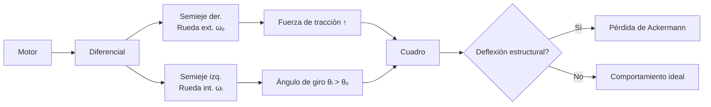

# Equipo [Team ValGrind]: WRO 2025

[](https://postimg.cc/fSTZzy81)

---

## Índice

1. [Nuestro Equipo](#nuestro-equipo)
    - [Integrantes](#integrantes)
    - [Origenes](#origenes)
    - [Nuestro Objetivo](#nuestro-objetivo)
2. [El Robot](#el-robot)
    - [Apartado Mecanico](#apartado-mecanico)
        - [Impresion 3D](#impresion-3d)
        - [Movilidad](#movilidad)
    - [Apartado Electronico](#apartado-electronico)
        - [Sensores](#sensores)
        - [Conexiones y Circuitos](#conexiones-y-circuitos)
        - [Microcontroladores](#microcontroladores)
    - [Apartado Programatico](#apartado-programatico)
        - [Codigo por Componente](#codigo-por-componente)
4. [Recursos para Hacer el Robot](#recdursos-para-hacer-el-robot)
    - [Mecanica](#mecanica)
    - [Electronica](#electronica)
    - [Programacion](#programacion)

---

## Nuestro Equipo

[](https://postimg.cc/rKqWdsNG)

Somos **[Team ValGrind]**, entusiastas de la robótica y la innovación. Representamos a nuestra institución en la fase regional de la **WRO 2025**.

---

### Integrantes

- **Samuel Burgos**  
  17 años, 09/01/2008  

[](https://postimg.cc/BLgVJGSN)

- **Sebastián Salina**  
  17 años, 22/08/2008 

[](https://postimg.cc/GH7xXcKJ)

- **Cristobal Mogollón**
   14 años, 14/07/2010
 [](https://postimg.cc/WdfddD3J)

- **Institución:** [Colegio Salto Ángel](https://www.instagram.com/colegiosaltoangel)
- **Instagram Oficial:** [@team_valgrind](https://instagram.com/team_valgrind)
- **Contáctanos:** [valgrind2025@gmail.com](mailto:valgrind2025@gmail.com)

---

### Origenes

El nombre de nuestro equipo fue decidido por los tres integrantes a partir de un clásico compilador de C++ llamado de la misma forma, el cual es representado por un logotipo de un dragón hecho con origami. El nombre "ValGrind" también hace referencia a la mitología nórdica debido a las legendarias Valquirias que habitan en este.

 [](https://postimg.cc/gryddns4)


> ### ¿Por qué nuestro robot se llama Heimdall?

Este nombre no solo es un guiño a la mitología mencionada, sino que además corresponde al dios conocido como el guardián de las puertas de Asgard y del puente Bifröst, que conecta los Nueve Mundos. Al ser un personaje imponente, consideramos que es un nombre apropiado para representar a nuestro robot en la WRO.


## Nuestro Objetivo

[](https://postimg.cc/t1LyR68v)

#### "Diseñar, Construir y Programar"
 Un robot autónomo capaz de superar los desafíos de la WRO 2025, utilizando innovación y trabajo en equipo para lograr un desempeño sobresaliente en la etapa regional y avanzar a la nacional. Para llegar a esto, hemos pasado los últimos meses diseñando, construyendo, armando y programando nuestro más nuevo proyecto "Heimdall"

 
> [!NOTE]
> La World Robot Olympiad (WRO) es una competencia internacional de robótica educativa que se desarrolla en varias fases, y nuestro equipo lógicamente tiene que comenzar por la fase regional, mediante la cual al ganarla se accede a la Fase Nacional. Cada país organiza su propio torneo clasificatorio, donde equipos de jóvenes compiten en distintas categorías, aplicando conocimientos de robótica y STEAM. Por último, la fase a la cual nuestro equipo quiere llegar es la Final Internacional. Los equipos ganadores de cada país participan en la competencia global, donde enfrentan desafíos más complejos y compiten con representantes de más de 95 países 

[](https://postimg.cc/yJrQXB1B)

Aún así, nuestro único objetivo no es solamente ganar, como un equipo unido también tenemos la convicción de poder crear un robot no solo funcional, sino que llene nuestras expectativas; A pesar de ser intangible nuestro deseo de poder culminar nuestro proyecto como un equipo unido y verlo brillar, también es una meta importante para nosotros.

---

## El Robot

[](https://postimg.cc/7Jr4sw5Y)

### Apartado Mecanico

| [](https://postimg.cc/CdWb2DhW) | [](https://postimg.cc/xqbzLCvg) | 
| :--: | :--: | 
| *Frontal* | *Posterior* |
|[](https://postimg.cc/tZnYdSx7) | [](https://postimg.cc/V0g40QKQ) | 
| *Izquierda* | *Derecha* |
|[](https://postimg.cc/tnFJBpLw) |  | 
| *Superior* | *Inferior* |

#### Impresion 3D

Antes de hablar de la movilidad o funcionalidad de nuestro robot, primero hay que explicar nuestros métodos de Diseño e Impresión 3D, los cuales se llevaron a cabo mediante Fusion 360


> [!NOTE]
> Fusion 360 es una plataforma de software de modelado 3D, CAD, CAM, CAE y PCB basada en la nube, destinada al diseño y la fabricación de productos. Nos permite diseñar y crear productos de acuerdo a sus especificaciones particulares, garantizando que cada pieza cumpla con los más exigentes criterios de estética, forma, ajuste y funcionalidad. Además, incorpora un conjunto integral de herramientas avanzadas para el diseño de placas de circuito impreso y componentes electrónicos, lo que facilita la conceptualización y materialización de cualquier idea, incluso las más complejas. Al implementar estas funciones, la plataforma optimiza significativamente tanto el tiempo como los costos asociados, asegurando que el proceso de producción se realice de manera eficiente y que las piezas obtenidas sean de la más alta calidad. Nosotros usamos esta herramienta gráfica y de diseño para realizar los diseños del chasis y las piezas personalizadas de nuestro robot.

[](https://postimg.cc/WhyYmSCX)

#### Movilidad

Ahora bien, ya habiendo dilucidado como podemos elegir, diseñar y imprimir las piezas de nuestro robot, hay que asegurarnos de que este cuente con las herramientas necesarias para moverse y evadir los obstáculos de la pista.

> [!NOTE]
> Video de Heimdall realizando el Open Challenge
[Video](https://youtu.be/zEmvAiKoWxc)

Nuestro robot emplea un sistema de tracción diferencial, ofreciendo maniobrabilidad precisa para enfrentar los retos del campo de competencia. El sistema de cruces se realiza mediante un servo que ajusta la dirección del robot en intersecciones de forma eficaz. También cabe destacar el hecho de que utilizamos una técnica llamada  Ackermann Positivo para emplear el sistema de movilidad de nuestro vehículo.

[](https://postimg.cc/bs9VrX1D)

##### El diferencial de los vehículos, como su nombre lo indica, permite que exista una diferencia en la velocidad de giro entre la rueda interna y la rueda externa del vehículo cuando se da una vuelta o se está girando la dirección. No importa si el vehículo es tracción trasera o delantera, la función es la misma.

[](https://postimg.cc/G4sWpg3Z)

####  Sistema de Movimiento y Tracción 

Ahondando en lo mencionado anteriormente, Heimdall utiliza lo que normalmente es denominado sistema ackermann positivo, el cual es un sistema derivado del principio de Ackermann, cuyo objetivo es lograr que en curvas la **rueda interior (θᵢ) gire más que la exterior (θₒ)** para minimizar deslizamiento lateral (*scrub*).  

- **Ecuación fundamental**:  
  **cot(θₒ) - cot(θᵢ) = W / L**  
  - *W*: Distancia entre pivotes de dirección (batalla)  
  - *L*: Distancia entre ejes  
  

### **Implementación Física**
```asciidoc
[Rueda exterior (θₒ)]
  │
  ├─── Brazo de dirección  
  │        \  
[Cuadro]──┤         \  
  │        │          \  
  │        │           ●── Centro teórico (eje trasero)  
  │        │          /  
  │        │         /  
  ├─── Brazo de dirección  
  │  
[Rueda interior (θᵢ > θₒ)]
```

---

##### **Relación de Velocidades en Curva**

```
ωₒ / ωᵢ = (R + W/2) / (R - W/2)
```
- `ωₒ`: Velocidad angular rueda exterior.  
- `ωᵢ`: Velocidad angular rueda interior.  
- `R`: Radio de giro del centro del eje.  

---

##### **Fuerzas en Conflicto**



> [!NOTE]
> De utilizar estos sistemas, recomendamos tener cuidado con los siguientes inconvenientes los cuales aparecieron dentro de nuestras prácticas con la implementación del mencionado sistema:

1. **Paradox Steering**:  
   - *Causa*: La tracción en la rueda interior (baja adherencia) contrarresta el ángulo de giro.  
   - *Solución*: Control electrónico (freno vectorial).  

2. **Fatiga en semiejes**:  
   - *Causa*: Torsión excesiva en juntas homocinéticas debido a θᵢ máximo + par motor.  
   - *Solución*: Semiejes asimétricos con ángulos de trabajo optimizados.  

---

##### Soluciones de Ingeniería
-  **Estrategias Recomendadas**

| **Componente**   | **Innovación**                                    | **Beneficio**                                  |
|------------------|--------------------------------------------------|-----------------------------------------------|
| **Cuadro**       | Subchasis desmontable con rigidez variable.      | Permite ajustes finos en competición.         |
| **Diferencial**  | Electrónico con mapas por ángulo de giro.        | Regula par según θᵢ/θₒ (ej: Honda SH-AWD).   |
| **Dirección**    | Brazo de Ackermann ajustable (rótulas roscadas). | Compensa desgaste o cambios de neumáticos.    |

--- 


[](https://postimg.cc/8syssXPz)

El núcleo de la movilidad de nuestro robot reside en su **subsistema mecánico de transmisión y tracción**, cuidadosamente seleccionado con componentes específicos de alta calidad. Vamos a desglosar cómo cada pieza encaja en este rompecabezas de ingeniería en miniatura, usando la escala **1/18** como referencia clave para tamaño e integración:

1.  **Diferenciales y Ejes de Transmisión (1/18)**

[](https://postimg.cc/947xWLFf)

[](https://postimg.cc/Cz6T56YC)


   ##### Los ubicamos en el eje motriz , permiten que las ruedas izquierda y derecha giren a velocidades diferentes al tomar curvas. Esto es *crucial* para evitar que el robot "patine" o forcejee en giros cerrados, manteniendo la estabilidad incluso durante maniobras agresivas. Su escala 1/18 garantiza que sean compactos, ligeros y proporcionales al resto del chasis y ruedas del robot de competición.
  ##### En cuanto a los ejes, estos conectan directamente la salida de los diferenciales (1/18) a las ruedas motrices. Transfieren el par motor generado hacia las ruedas, haciendo girar los neumáticos. Su diseño a escala 1/18 asegura la longitud y resistencia adecuadas para soportar las fuerzas de torsión y tracción sin añadir peso excesivo ni desbalancear el robot.

_foto stl eje_

2. **Motor Brushed INJ 2065**

info detallada

_cuadro información general_

3.  **Ruedas del Robot**

info general 

4.  **Tornillos, Tuercas de Seguridad y Arandelas (M2 y M3)**

[](https://postimg.cc/cvHx5n1h)

 ##### Ya sean M2 o M3, son piezas imprescindibles para la mecanica de nuestro robot, debido a la fijacion de piezas pequeñas, estabilización de componentes, y la garantía de seguridad que otorgan con respecto al uso prolongado del robot ya sea en practicas o en la competición.
 ##### Se decidió tomar la decisión de tener tornillos M2 y M3 de forma simultánea para velar por la eficiencia del espacio, para permitir compatibilidad con los componentes más pequeños, y al mismo tiempo para garantizar que los tornillos resistan y permitan estabilidad en el robot.
     
---

### Apartado Electronico

Para el proyecto, decidimos usar;

#### **Baterías**
foto tenergy 12v 

 ##### info general
 cuadro de info
 recomendaciones

### **LM2596**  
##### El LM2596 es un regulador step down DC-DC diseñado para transformar tensiones elevadas en niveles adecuados para circuitos electrónicos.  Acepta un rango de entrada entre 4V y 35V, Lo cual evidentemente demuestra que es un componente electrónico bastante versátil en lo que al manejo de voltaje respecta, por lo tanto nuestro equipo decidió utilizarlo para poder manejar el voltaje en el circuito del robot de forma idónea.

cuadro del datasheet, funcion e importancia dentro del robot

[](https://postimg.cc/RJML9J83)


#### Motor DC 12V greartisan

foto
info general
especificaciones

**Razones por las cuales decidimos utilizar este motor:**

- **Voltaje nominal:** Opera con 12V (puede tolerar ligeras variaciones, ej. 9-15V).  
- **Tipo común:** Motor de *escobillas (brushed)*, con imanes permanentes y un rotor bobinado.  
- **Salida:** Genera par de giro (*torque*) y velocidad (RPM) proporcionales al voltaje aplicado.  
- **Uso universal:** Barato, fácil de controlar y ampliamente disponible.

diferencias entre voltaje nominal y voltaje real del robot y reduccion 

#### Driver L298N

foto toto

Es un **controlador de motores de doble puente H (dual H-bridge)** encapsulado en un circuito integrado. Su función principal es actuar como un "intermediario de potencia" entre dispositivos de control de baja potencia (como Arduino) y motores de alta potencia (como tu motor DC 12V).

**Es extremadamente útil para nuestro proyecto debido a su:**

1. **Amplificación de corriente:**  
   - Los microcontroladores solo pueden entregar ~20-40mA por pin.  
   - El L298N soporta hasta **2A por canal** (suficiente para motores medianos).  
2. **Control direccional:**  
   - Permite invertir la polaridad del voltaje aplicado al motor para cambiar su giro (adelante/atrás).  
3. **Protección eléctrica:**  
   - Aísla el circuito de control de los picos de voltaje generados por el motor.  
4. **Manejo de alta tensión:**  
   - Soporta motores de 5V a 35V (ideal para tu motor 12V).  

---

#### **Partes clave del módulo L298N:**  
| **Componente**      | **Función**                                                                 |
|---------------------|-----------------------------------------------------------------------------|
| **Puertos de salida** (OUT1, OUT2, OUT3, OUT4) | Conectan los motores (2 motores DC o 1 motor paso a paso).                  |
| **Entradas lógicas** (IN1, IN2, IN3, IN4) | Reciben señales de control desde Arduino (determinan dirección).          |
| **Pines de habilitación** (ENA, ENB) | Activan/desactivan los canales (con/sin PWM).                             |
| **Regulador de 5V** | Provee energía a la lógica (puede alimentar al Arduino si se usa el jumper).|
| **Disipador de calor** | Metálico, previene sobrecalentamiento durante uso prolongado.             |
| **Jumpers**         | Configuran el modo de operación (ej: habilitación permanente de canales). |

---

#### **¿Cómo controla un motor DC?**  
Usa un circuito **puente H (H-bridge)** interno:  
``` 
   [IN1] --[SW1]---- Motor ----[SW3]-- [IN2]  
               |                   |  
              [SW2]               [SW4]  
```  
- **Giro adelante:**  
  `IN1 = HIGH` (SW1 cerrado) + `IN2 = LOW` (SW4 cerrado) → Corriente fluye: SW1 → Motor → SW4  
- **Giro atrás:**  
  `IN1 = LOW` (SW2 cerrado) + `IN2 = HIGH` (SW3 cerrado) → Corriente fluye: SW3 → Motor → SW2  
- **Frenado:**  
  `IN1 = HIGH` + `IN2 = HIGH` → Cortocircuito en bornes del motor (frena rápidamente).  

---


#### Sensores Ultrasónicos 

[](https://postimg.cc/N94J25h9)

##### El robot cuenta con múltiples sensores ultrasónicos (HC-SR04) ubicados estratégicamente para la detección de obstáculos y el cálculo de distancias, permitiendo navegación autónoma y segura. El sensor HC-SR04 es un sensor de distancia de bajo costo, por lo que su uso es muy frecuente en la robótica. Incorpora un par de transductores de ultrasonido que se utilizan de manera conjunta para determinar la distancia del sensor con un objeto colocado frente a este. Un transductor emite una ráfaga de ultrasonido y el otro capta el rebote de dicha onda.

> [!NOTE]
> El tiempo que tarda la onda sonora en ir y regresar a un objeto puede utilizarse para conocer la distancia entre el origen del sonido y el objeto. La interfaz del sensor HC-SR04 y Arduino se logra mediante 2 pines digitales: el pin de disparo (trigger) y el pin de eco (echo). La función de cada uno de estos pines es la siguiente:
- El pin trigger recibe un pulso de habilitación del microcontrolador, mediante el cual se le indica al módulo que comience a realizar la medición de distancia.
- En el pin echo el sensor devuelve al microcontrolador un pulso cuyo ancho es proporcional al tiempo que tarda el sonido en viajar del transductor al obstáculo y luego de vuelta al módulo

- mas info

#### Pixy2

<fotos del entrenamiento de signatures, librerías, mucha paja

### Conexiones y Circuitos

##### Todos los módulos están conectados en un circuito organizado, minimizando interferencias y facilitando el mantenimiento.  

#### Diagramas de Flujo

##### En este diagrama de flujo se halla una representación gráfica del funcionamiento lógico de nuestra programación, así como de lo que se espera sea el desempeño del robot al inicializar el programa.

##### Desafío Abierto

##### Desafío Cerrado
```mermaid
flowchart LR
    A[Inicio] --> B[setup()]
    B --> C{¿Botón presionado?}
    C -- No --> C
    C -- Sí --> D[programaIniciado = true]
    D --> E[loop()]
    E --> F{¿finalizado?}
    F -- Sí --> G[Termina]
    F -- No --> H[controlarRobot()]
    H --> I[Lectura de sensores ultrasónicos]
    I --> J[Lectura de Pixy2]
    J --> K{¿Pixy2 detecta bloques?}
    K -- Sí --> L[goToPosition()]
    K -- No --> M{¿contadorGiros >= 12?}
    M -- Sí --> N[Adelante y Parar - finalizado=true]
    M -- No --> O{¿Obstáculo al frente?}
    O -- No --> P{¿Espacio a la izquierda?}
    P -- Sí --> Q[Gira a la izquierda, actualiza contadorGiros]
    P -- No --> R{¿Espacio a la derecha?}
    R -- Sí --> S[Gira a la derecha, actualiza contadorGiros]
    R -- No --> T[Continúa Adelante]
    O -- Sí --> U[Parar]
    N --> G
    Q --> G
    S --> G
    T --> G
    U --> G
```

#### Diagrama de Conexiones 

#### Microcontroladores

##### ESP-32

[](https://postimg.cc/f3gkzvyJ)

##### El **ESP32-WROOM** es un módulo todo-en-uno potente y económico basado en el chip ESP32, que integra un **procesador dual-core de hasta 240 MHz**, **Wi-Fi 802.11 b/g/n (2.4 GHz)**, y **Bluetooth (Clásico y BLE)**, junto con **4 MB de memoria flash SPI y 520 KB de RAM** en el mismo encapsulado, además de una antena PCB integrada; ofrece múltiples periféricos (GPIOs, ADC, DAC, UART, SPI, I2C, PWM, etc.), soporta modos de bajo consumo para baterías, y es ideal para proyectos de IoT, domótica, robótica o interfaces, siendo fácil de programar con Arduino IDE, ESP-IDF o MicroPython.
##### Además del microcontrolador, también es necesario tener un buen entorno con las librerías necesarias para compilar y interpretar el código, y eventualmente crear un ecosistema óptimo para nuestro robot. Por esto, hemos decidido utilizar 4 librerías esenciales para lograr nuestro objetivo:

1.  **`Wire.h` (Comunicación I²C):**  
    Esencial para conectar sensores, pantallas (OLED) o memorias (EEPROM) que usen el bus I²C. Con `Wire.begin(SDA, SCL)` configuras los pines, luego usas `Wire.beginTransmission()`, `Wire.write()`, `Wire.read()` y `Wire.endTransmission()` para enviar/recibir datos. A partir de esta librería establecemos comunicación con el ESP-32.

2.  **`Ultrasonic.h` (Sensor de Distancia):**  
    Simplifica el uso de sensores como el HC-SR04. Con `Ultrasonic ultrasonic(TRIG, ECHO)` inicializas, y `ultrasonic.read()` devuelve la distancia en cm. Ideal para evadir los obstáculos de la pista y evitar colisiones con las paredes ya sean internas o externas. Así como sistemas de estacionamiento o cualquier proyecto que requiera detección de proximidad sin contacto, manejando automáticamente los pulsos de medición.

3.  **`ESP32Servo.h` (Control de Servomotores):**  
    Librería específica para manejar servos en el ESP32, ya que los timers PWM son distintos a Arduino. Con `servo.attach(PIN)` configuras y `servo.write(grados)` posicionas el servo (0°-180°). Crucial para manejar automatismos y conseguir movimiento angular preciso con motores de bajo torque.

4.  **`Pixy2.h` (Cámara Inteligente Pixy2):**  
    Facilita la comunicación con la cámara Pixy2 (vía I²C) para visión artificial simple. Detecta objetos por color, formas (bloques) o líneas. Usas `pixy.init()` y `pixy.ccc.getBlocks()` para obtener datos. A partir de la pixy, podemos crear código que pueda identificar los bloques verdes, rojos, y el estacionamiento magenta para que actúe acorde y pueda realizar el desafío cerrado.

---

### Apartado Programatico

#### Codigo por Componente

##### Desafío Abierto

- En cuanto al código utilizado para manejar el robot, consiste en una parte en la que se definen los pines del ESC y de los ultrasónicos. Dentro del código se arma el ESC, se inicializan los sensores y se inicializa una función llamada "doceVueltas", la cual se encarga de hacer una lectura constante de los sensores ultrasónicos para decidir en qué momento girar, así como de registrar los giros para que el robot se detenga al completar exitosamente 3 vueltas.

En este apartado se inicializa el ESC, y se prepara el robot para ejecutar la función que sigue:
```cpp
inicio del código 
```

Y en este, se llama a la función de DoceGiros, la cual ejecuta los giros y ajustes específicos del robot 

```cpp
if (contadorGiros >= 12) {
    // Avanzar 1 segundo más y detenerse definitivamente
    if (!finalizado) {
      Serial.println("Se alcanzaron 12 giros, avanzando 1 segundo más y deteniéndose.");
      Adelante();
      delay(1000);
      Parar();
      motorEnMarcha = false;
      finalizado = true;
    }
    return;
  }

  if (!girando) {
    if (frontal != -1 && frontal > DISTANCIA_OBSTACULO_FRONTAL) {
      if (!motorEnMarcha) {
        Adelante();
        motorEnMarcha = true;
      }

      if (ahora - tiempoUltimoGiro < TIEMPO_ESPERA_GIRO) {
        Serial.println("Avanzando recto después del giro, sin girar");
      } else {
        if (izquierda != -1 && izquierda > DISTANCIA_OBSTACULO_LATERAL) {
          girando = true;
          Parar();
          motorEnMarcha = false;
          Serial.println("Girando a la izquierda por más de 190 cm libres");
          Izquierda();
          contadorGiros++;
          girando = false;
          tiempoUltimoGiro = millis();
          Adelante();
          motorEnMarcha = true;
        } else if (derecha != -1 && derecha > DISTANCIA_OBSTACULO_LATERAL) {
          girando = true;
          Parar();
          motorEnMarcha = false;
          Serial.println("Girando a la derecha por más de 190 cm libres");
          Derecha();
          contadorGiros++;
          girando = false;
          tiempoUltimoGiro = millis();
          Adelante();
          motorEnMarcha = true;
        }
      }
    } else if (frontal != -1 && frontal <= DISTANCIA_OBSTACULO_FRONTAL) {
      if (motorEnMarcha) {
        Parar();
        motorEnMarcha = false;
      }
      Serial.println("Obstáculo frontal detectado, detenido");
    }
  }
}
```

##### Desafío Cerrado

- Con respecto al desafío cerrado, nos decantamos por utilizar la pixy en virtud de poder detectar los bloques y posteriormente tener un código con un protocolo para cada uno de ellos, esto se puede evidenciar en el código:


```cpp
  pixy.ccc.getBlocks();
  bool bloqueRojo = false;
  bool bloqueVerde = false;

  for (uint16_t i = 0; i < pixy.ccc.numBlocks; i++) {
    if (pixy.ccc.blocks[i].m_signature == ROJO_SIGNATURE) bloqueRojo = true;
    if (pixy.ccc.blocks[i].m_signature == VERDE_SIGNATURE) bloqueVerde = true;
  }

  pixy.setLamp(bloqueRojo || bloqueVerde, bloqueRojo || bloqueVerde);

  if (bloqueRojo) {
    Parar();
    delay(100);
    Derechabloque();
    Adelante();
    motorEnMarcha = true;
    delay(120);
    return;

```

Dentro de `Desafio-abierto.ino` y `Desafio-cerrado.ino` está el resto de funciones descritas, y la lógica de programación mediante la cual el robot completa el desafío abierto.

#### Compiladores y Comunicacion

- **Lenguaje principal:** C++ (Arduino IDE)
- **Compilador:** [Arduino IDE](https://www.arduino.cc/en/software- **Comunicación entre módulos:** Bus I2C

---

## Recursos para Hacer el Robot

### Mecánico
- Diferenciales 1/28
- Ejes de Transmisión 1/18
- Motor Brushed Injora 180° 48T
- Ruedas de Drift 1/18
- Tuercas de Seguridad M2
- Tornillos M3
- Incertos Roscados M2
- Nudillos de Cruce
- Rolineras
- Urgenex Li-Ion 3000mAh
### Electrónico 
- ESC
- ESP-32
- MPU6050
- Ultrasónicos HSR04
### Programación 
- Open-Challenge.ino
- Closed-Challenge.ino

---

> _¿Quieres contribuir o seguir nuestro avance? Síguenos en nuestras redes oficiales y revisa este repositorio para novedades y recursos._

---
