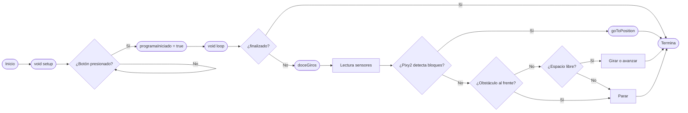

```mermaid
flowchart LR
    A([Inicio]) --> B([void setup])
    B --> C{¿Botón presionado?}
    C -- No --> C
    C -- Sí --> D([programaIniciado = true])
    D --> E([void loop])
    E --> F{¿finalizado?}
    F -- Sí --> G([Termina])
    F -- No --> H([doceGiros])
    H --> I[Lectura sensores]
    I --> J{¿Pixy2 detecta bloques?}
    J -- Sí --> K([goToPosition])
    J -- No --> L{¿Obstáculo al frente?}
    L -- No --> M{¿Espacio libre?}
    M -- Sí --> N[Girar o avanzar]
    M -- No --> O[Parar]
    L -- Sí --> O
    K --> G
    N --> G
    O --> G
```